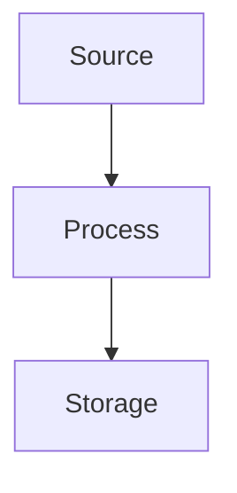

# System/Module Name

## Design Philosophy
Why was it built this way? (e.g., Performance, Modularity)

## Data Flow

```mermaid
graph TD
    A[Source] --> B[Process]
    B --> C[Storage]
```

## structs & Traits
Key Rust structures involved.
