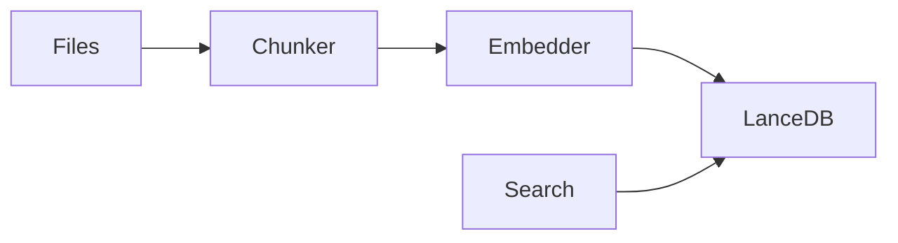

# Code RAG – Local Code Search with Embeddings

`code-rag` is a local-first code indexing and semantic search tool.

It:
- 📁 Scans a folder with source code
- ✂️ Splits files into chunks
- 🧠 Generates embeddings locally (no cloud)
- 🗄️ Stores them in a local LanceDB vector database
- 🔍 Lets you search your code using natural language

**Everything runs 100% locally.**

## 📦 What files / DB does it create?

When you run indexing, it creates this folder:

```
./.lancedb/
```

Inside:
```
./.lancedb/
  └── code_chunks/   (LanceDB table)
```

So:
- ✅ **Database location:** `./.lancedb` (relative to where you run the app)
- ✅ **Table name:** `code_chunks`
- ✅ You can delete `.lancedb` anytime to reset the index
- ✅ **Default Database Path:** `./.lancedb` (can be changed in config or via `--db-path`)

## 📁 File Exclusion (Ignored files)

`code-rag` is designed to be efficient and respectful of your project settings. By default, it automatically ignores:

-   **`.gitignore`**: Anything listed in your gitignore will not be indexed.
-   **`.ignore`**: If you want to ignore files specifically for `code-rag` but keep them in Git, use this file.
-   **Hidden Files**: Files and folders starting with a dot (e.g., `.git/`, `.env`) are ignored.
-   **System/Global ignores**: Your global Git configuration is also respected.

This ensures you don't accidentally index `node_modules`, `target/`, or other massive build artifacts.

## 🚀 How to use

### 1️⃣ Index a project

This scans and indexes a folder:

```bash
code-rag index /path/to/your/project
```

Update an existing index (incremental):

```bash
code-rag index --update
```

Force a fresh re-index:

```bash
code-rag index --force
```

**What it does:**
- Walks all files recursively
- Detects supported code files (Rust, Python, Go, C/C++, JS/TS, Java, C#, Ruby, PHP, HTML, CSS)
- Splits them into semantic chunks (functions, classes, etc.)
- extracts function calls/usages
- Generates embeddings
- Saves them to `./.lancedb/code_chunks`

See `docs/commands/index_cmd.md` for full reference.

### 2️⃣ Search using natural language

```bash
code-rag search "how do we load the config file?"
```

With limit:

```bash
code-rag search "vector database initialization" --limit 10
```

Generate an HTML report:

```bash
code-rag search "authentication logic" --html
```

**NEW: JSON output for automation:**

```bash
code-rag search "database setup" --json | ConvertFrom-Json
```

**NEW: Filter by file extension:**

```bash
code-rag search "authentication" --ext rs  # Only Rust files
code-rag search "config parser" --ext py   # Only Python files
```

**NEW: Filter by directory:**

```bash
code-rag search "api handler" --dir "src/api"
```

**NEW: Skip Re-ranking for speed:**

```bash
code-rag search "quick query" --no-rerank
```

**What it does:**
- Converts your query to an embedding
- Performs a hybrid search (Vector + Re-ranking)
- Uses `BGE-Reranker` to refine the top results
- Returns the most similar code chunks
- Displays extracted call hierarchy (what functions are called)

See `docs/commands/search.md` for full reference.

### 3️⃣ Grep-style text search

```bash
code-rag grep "tokio::main"
```

**NEW: JSON output:**

```bash
code-rag grep "async fn" --json
```

This is a simple text search, not semantic. See `docs/commands/grep.md`.

### 4️⃣ Start HTTP Server

```bash
code-rag serve --port 3000
```

Starts a persistent HTTP server for API access.

**Options:**
- `--port <PORT>`: Port to listen on (default: 3000)
- `--host <HOST>`: Host to bind to (default: 127.0.0.1)
- `--db-path <PATH>`: Custom database path

See `docs/commands/serve.md` or `docs/features/server_mode.md` for details.

## 🧠 Embedding model used

Your app uses: **NomicEmbedTextV15**

- Runs locally
- Downloaded automatically on first use
- Cached on your machine

See [AI Models](docs/configuration/models.md) for more info on supported models and how they work.

**Supported Files:**
- Rust (`.rs`)
- Python (`.py`)
- JavaScript/TypeScript (`.js`, `.jsx`, `.ts`, `.tsx`)
- Go (`.go`)
- C/C++ (`.c`, `.h`, `.cpp`, `.hpp`, `.cc`, `.cxx`)
- Java (`.java`)
- C# (`.cs`)
- Ruby (`.rb`)
- PHP (`.php`)
- HTML (`.html`)
- CSS (`.css`)
- Bash/Shell (`.sh`, `.bash`)
- PowerShell (`.ps1`)
- YAML (`.yaml`, `.yml`)
- JSON (`.json`)
- Zig (`.zig`)
- Elixir (`.ex`, `.exs`)
- Haskell (`.hs`)
- Solidity (`.sol`)

See [Supported Languages](docs/features/supported_languages.md) for full details on what is extracted for each language.

## 🗑️ How to reset the database

Just delete:

```bash
rm -rf ./.lancedb
```

Or on Windows:

```powershell
Remove-Item -Recurse -Force .\.lancedb
```

Then re-run:

```bash
code-rag index .
```

## ⚙️ Configuration (`config_rag.toml`)

You can create a `config_rag.toml` file in your project root to avoid typing the same paths repeatedly.

The tool loads configuration in this order:
1.  **CLI Flags** (e.g., `--db-path`)
2.  **Local Config** (`./config_rag.toml`)
3.  **Global Config** (`~/.config/code-rag/config_rag.toml`)
4.  **Environment Variables** (Prefix `CODE_RAG_`)

**Example `config_rag.toml`:**
```toml
# Use single quotes for Windows paths!
db_path = './.lancedb'
default_index_path = '.'
```

See `code-rag.toml.example` for a template.

## 📂 Example workflow

```bash
# 1) Index your repo
code-rag index .

# 2) Ask questions
code-rag search "where is the database initialized?"

code-rag search "how embeddings are generated" --limit 5
```

## ⚖️ Resource Management

Control how `code-rag` uses system resources during indexing.

### CLI Arguments
```bash
# Low priority to avoid slowing down your PC
code-rag index . --priority low

# Smaller batches to save RAM
code-rag index . --batch-size 50
```

### Configuration
You can also set these in `config_rag.toml`:
```toml
priority = 'low'
batch_size = 100
```

## ⚙️ Build

### Windows

**Debug Build:**
```powershell
.\build.ps1
```

**Release Build:**
```powershell
.\build.ps1 release
```

**Interactive Menu:**
```powershell
.\interactive_build.ps1
```

### Linux / macOS

**Debug Build:**
```bash
./build.sh
```

**Release Build:**
```bash
./build.sh release
```

## 🔒 Privacy

- ✅ No cloud calls (Embeddings run locally)
- ✅ **Opt-in Only** Telemetry (Disabled by default)
- ✅ Everything stored locally in `./.lancedb`

## 📊 Telemetry (Optional)

`code-rag` supports OpenTelemetry for tracing and metrics. This is **disabled by default**.

To enable it, set `telemetry_enabled = true` in your `config_rag.toml`.

**Infrastructure:**
We provide a pre-configured observability stack (Jaeger, Prometheus, Grafana).

```bash
docker-compose -f docker-compose.telemetry.yml up -d
```

- **Jaeger (Traces):** http://localhost:16686
- **Prometheus (Metrics):** http://localhost:9090
- **Grafana (Dashboards):** http://localhost:3000

## 🧱 Internal architecture (simple)



## 🛣️ Roadmap

### ✅ Phase 1: Core Functionality (Complete)
- Local-first indexing and search
- Multi-language support
- Semantic chunking with Tree-sitter

### ✅ Phase 2: Programmatic Access (Complete)
- JSON output mode for CI/CD integration
- Extended language support (Zig, Elixir, Haskell, Solidity)
- Cross-encoder reranking for improved accuracy

### ✅ Phase 3: Metadata Filtering (In Progress)
- Filter by file extension (`--ext`)
- Filter by directory (`--dir`)

### 🔜 Future Ideas
- Real-time file system watcher
- Query expansion with local LLM
- LSP integration for IDE support
- Web UI
- Git blame integration

## 🤝 Contributing

We use [Lefthook](https://github.com/evilmartians/lefthook) to ensure code quality. Please see [CONTRIBUTING.md](CONTRIBUTING.md) for setup instructions.

## 🆘 Troubleshooting

**“My search returns nothing”**

- Did you run index first?
- Does `./.lancedb` exist?
- Try reindexing:

```bash
rm -rf ./.lancedb
code-rag index .
```
