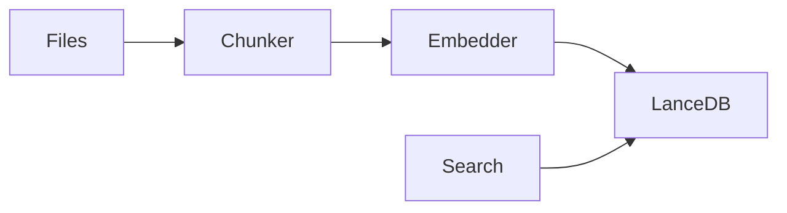

# Code RAG – Local Code Search with Embeddings

`code-rag` is a local-first code indexing and semantic search tool.

It:
- 📁 Scans a folder with source code
- ✂️ Splits files into chunks
- 🧠 Generates embeddings locally (no cloud)
- 🗄️ Stores them in a local LanceDB vector database
- 🔍 Lets you search your code using natural language

**Everything runs 100% locally.**

## 📦 What files / DB does it create?

When you run indexing, it creates this folder:

```
./.lancedb/
```

Inside:
```
./.lancedb/
  └── code_chunks/   (LanceDB table)
```

So:
- ✅ **Database location:** `./.lancedb` (relative to where you run the app)
- ✅ **Table name:** `code_chunks`
- ✅ You can delete `.lancedb` anytime to reset the index

## 🚀 How to use

### 1️⃣ Index a project

This scans and indexes a folder:

```bash
code-rag index /path/to/your/project
```

Example:

```bash
code-rag index .
```

**What it does:**
- Walks all files recursively
- Detects supported code files
- Splits them into chunks
- Generates embeddings
- Saves them to `./.lancedb/code_chunks`

### 2️⃣ Search using natural language

```bash
code-rag search "how do we load the config file?"
```

With limit:

```bash
code-rag search "vector database initialization" --limit 10
```

**What it does:**
- Converts your query to an embedding
- Searches in LanceDB
- Returns the most similar code chunks

### 3️⃣ Grep-style text search

```bash
code-rag grep "tokio::main"
```

This is a simple text search, not semantic.

## 🧠 Embedding model used

Your app uses: **NomicEmbedTextV15**

- Runs locally
- Downloaded automatically on first use
- Cached on your machine

## 📁 Supported languages

Your `CodeChunker` detects languages by file extension (from `indexer.rs`).
*(You can extend this easily later.)*

## 🗑️ How to reset the database

Just delete:

```bash
rm -rf ./.lancedb
```

Or on Windows:

```powershell
Remove-Item -Recurse -Force .\.lancedb
```

Then re-run:

```bash
code-rag index .
```

## 📂 Example workflow

```bash
# 1) Index your repo
code-rag index .

# 2) Ask questions
code-rag search "where is the database initialized?"

code-rag search "how embeddings are generated" --limit 5
```

## ⚙️ Build

### Windows (MSVC)

```powershell
cargo build --release --bin code-rag
```

Binary: `target\release\code-rag.exe`

### Linux (Docker)

Use your Docker pipeline.

## 🔒 Privacy

- ✅ No cloud calls
- ✅ No telemetry
- ✅ Everything stored locally in `./.lancedb`

## 🧱 Internal architecture (simple)



## 🛣️ Future improvements (ideas)

- Web UI
- File path filtering
- Reindex only changed files
- Metadata (git blame, timestamps, etc)
- Hybrid BM25 + vector search

## 🆘 Troubleshooting

**“My search returns nothing”**

- Did you run index first?
- Does `./.lancedb` exist?
- Try reindexing:

```bash
rm -rf ./.lancedb
code-rag index .
```
