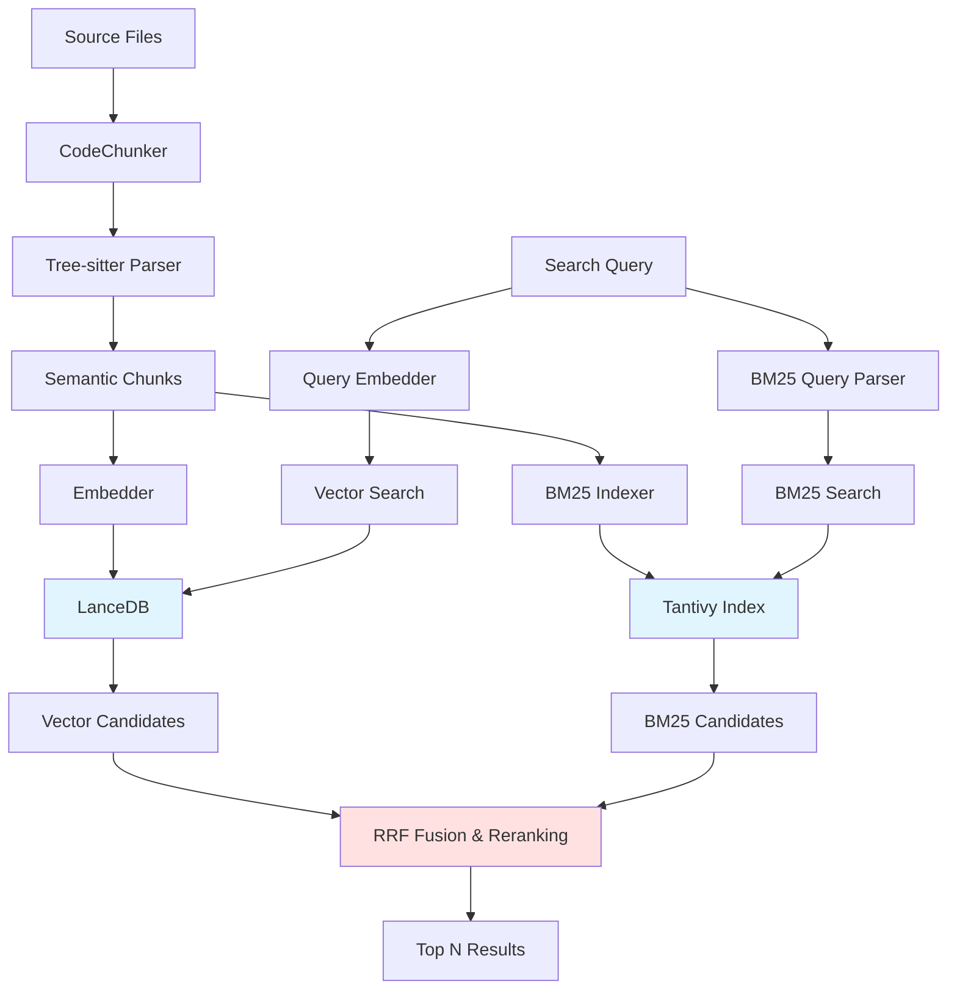
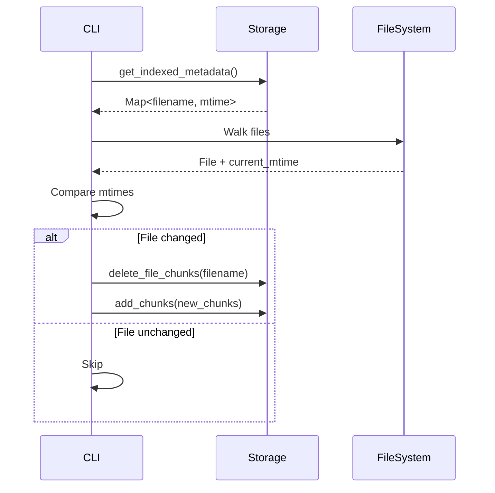

# Architecture Overview

This document explains the internal architecture of `code-rag`.

## High-Level Architecture



## Core Components

### 1. CodeChunker (`src/indexer.rs`)
**Responsibility**: Parse source files and extract semantic chunks.

**Process**:
1. Detect language by file extension
2. Load appropriate Tree-sitter grammar
3. Streaming parse of file into AST (low memory footprint)
4. Traverse AST to find semantic nodes:
   - Functions, methods
   - Classes, structs, interfaces
   - Modules, namespaces
   - Top-level scripts (Python `if __name__`)
5. Extract function calls within each chunk
6. Return `Vec<CodeChunk>`

**Key Data Structure**:
```rust
pub struct CodeChunk {
    pub filename: String,
    pub code: String,
    pub line_start: usize,
    pub line_end: usize,
    pub last_modified: i64,
    pub calls: Vec<String>,
}
```

### 2. Embedder (`src/embedding.rs`)
**Responsibility**: Generate vector embeddings and re-rank results.

**Models**:
- **Embedding**: `nomic-embed-text-v1.5` (8192 token context)
- **Re-ranking**: `BGE-Reranker-Base` (Cross-Encoder)

**Process**:
1. Convert text to embeddings using ONNX runtime
2. Lazy-load re-ranker on first search
3. Cache models in `~/.cache/fastembed/`

### 3. Storage (`src/storage.rs`)
**Responsibility**: Manage LanceDB table and queries.

**Schema**:
```rust
{
    id: String,
    filename: String,
    code: String,
    line_start: Int32,
    line_end: Int32,
    last_modified: Int64,
    calls: List<String>,
    vector: FixedSizeList<Float32>[768]
}
```

**Operations**:
- `init()`: Create table if not exists
- `add_chunks()`: Batch insert with embeddings
- `search()`: ANN vector search
- `get_indexed_metadata()`: Fetch mtimes for incremental indexing
- `delete_file_chunks()`: Remove chunks by filename

### 4. CodeSearcher (`src/search.rs`)
**Responsibility**: Orchestrate search pipeline (Hybrid Search).

**Hybrid Search Strategy**:
1.  **Vector Search**: Finds semantic matches.
2.  **BM25 Search**: Finds exact keyword matches.
3.  **fusion**: Reciprocal Rank Fusion (RRF) combines scores.
    - `score = 1.0 / (k + rank)` where k=60
4.  **Re-ranking**: Cross-encoder re-ranks the top fused candidates.

```rust
async fn semantic_search(query: &str, limit: usize) -> Vec<SearchResult> {
    // Stage 1: Parallel Search
    let (vec_results, bm25_results) = join!(vector_search(), bm25_search());
    
    // Stage 2: RRF Fusion
    let candidates = rrf_merge(vec_results, bm25_results);
    
    // Stage 3: Re-ranking
    let texts = candidates.iter().map(|c| c.code).collect();
    let reranked = embedder.rerank(query, texts)?;
    
    // Sort & Return
    candidates.sort_by_score(reranked);
    candidates
}
```

### 5. Reporting (`src/reporting.rs`)
**Responsibility**: Generate HTML reports.

**Template Engine**: `minijinja`

**Output**: Styled HTML with:
- Result cards
- Syntax highlighting
- Call hierarchy tags
- Relevance scores

### 6. Server (`src/server.rs`)
**Responsibility**: Provide HTTP API for indexing and search.

**Endpoints**:
- `POST /search`: JSON search API
- `POST /index`: Trigger indexing job
- `GET /health`: Health check

## Data Flow

### Indexing Flow
```
Files → Chunker → Embedder → LanceDB
  ↓        ↓         ↓          ↓
 .rs    AST Parse  Vector   .lancedb/
 .py    Extract   [768]    code_chunks/
 .js    Chunks    dims        +
                              ↓
                          Tantivy (BM25)
                          .lancedb/bm25_index/
```

### Search Flow
```
Query → Embed → Vector Search ↘
  ↓       ↓          ↓           RRF Fusion → Re-rank → Results
 "auth" [768]    Top 50 (Vec) ↗    +
        dims          +         Top 50 (BM25)
                BM25 Search ↗
```

## Performance Characteristics

### Indexing
- **Parsing**: O(n) where n = file size
- **Embedding**: Batched (100 chunks/batch)
- **Storage**: Async writes to LanceDB

### Search
- **Vector Search**: O(log n) with HNSW index
- **Re-ranking**: O(k) where k = candidates (typically 50)
- **Total Latency**: 50-200ms (vector) + 500-1000ms (re-rank, first run)

## Incremental Indexing



## Security & Privacy

- **No Network Calls**: All processing is local
- **No Telemetry**: Zero data collection
- **Model Storage**: `~/.cache/fastembed/` (user-controlled)
- **Database**: Local `.lancedb` directory

## Dependencies

### Core
- `lancedb`: Vector database
- `fastembed`: Embedding & re-ranking models
- `tree-sitter-*`: Language parsers
- `arrow-array`: Columnar data format

### CLI
- `clap`: Argument parsing
- `tokio`: Async runtime
- `indicatif`: Progress bars
- `colored`: Terminal colors

### Search
- `grep-*`: Ripgrep integration
- `tantivy`: BM25 Search
- `ignore`: `.gitignore` handling

## Future Enhancements

1. **Hybrid Search**: Combine BM25 + Vector
2. **Graph Database**: Store call graphs
3. **LSP Integration**: Real-time indexing
4. **Web UI**: Browser-based interface
5. **IDE Plugins**: VS Code / JetBrains integration
