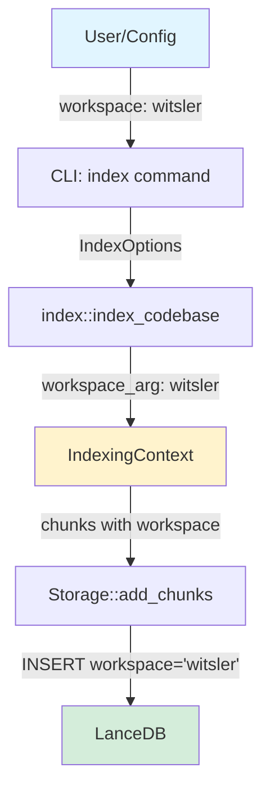
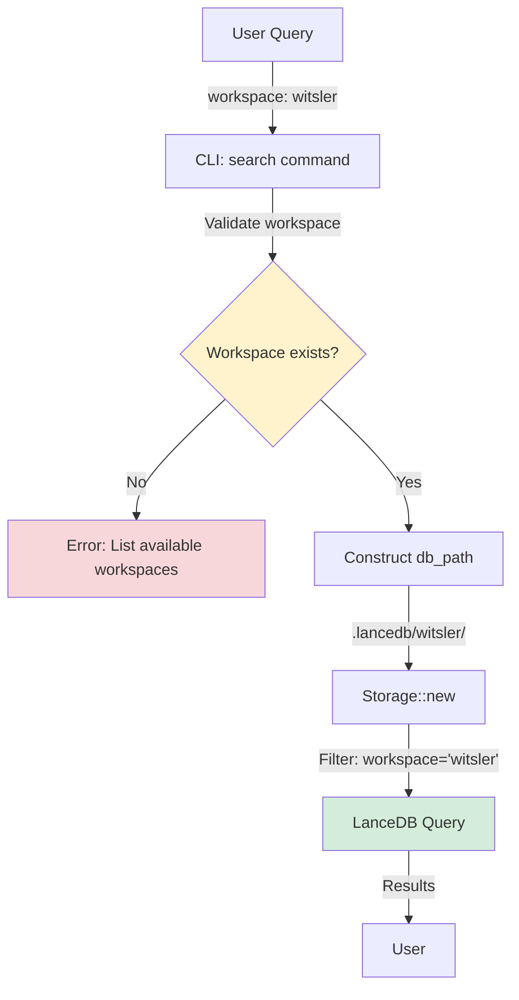
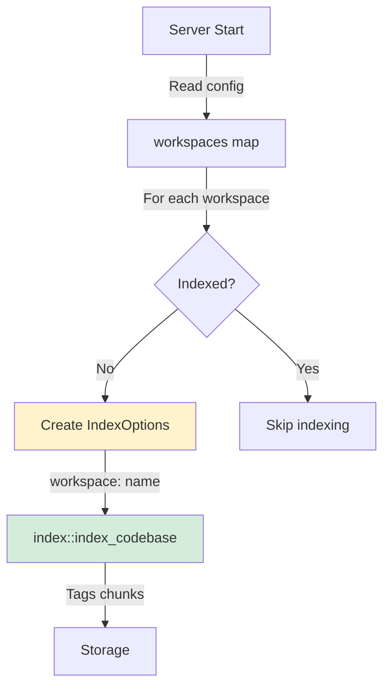

# Component Relationships & Data Flow

## Overview
This document maps the relationships between components in `code-rag` and documents critical data flows, particularly around workspace handling which is central to the application's multi-tenancy support.

## Key Architectural Concepts

### 1. Workspace vs Table Name (Critical Distinction)

| Concept | Purpose | Example | Usage |
|---------|---------|---------|-------|
| **Workspace Name** | User-facing identifier for isolated indexes | `"witsler"`, `"project-a"` | Config, filtering, API endpoints |
| **Table Name** | Internal LanceDB table name (always fixed) | `"code_chunks"` | Storage layer only |
| **Workspace Column** | Database column storing workspace identifier | `workspace = "witsler"` | Filtering queries |

> **⚠️ Critical**: The workspace NAME (identifier) is what gets stored in the `workspace` column of each chunk. The table NAME is always `"code_chunks"` and is purely an implementation detail.

### 2. Directory Structure (Nested Workspace Strategy)

```
.lancedb/                          # Root database directory
├── code_chunks.lance/             # Default workspace table
│   ├── data/                      # LanceDB data files
│   └── _versions/                 # Version control
├── bm25_index/                    # Default workspace BM25 index
├── witsler/                       # Custom workspace directory
│   ├── code_chunks.lance/         # Table (name always "code_chunks")
│   │   └── data/
│   └── bm25_index/                # Workspace-specific BM25
└── project-a/                     # Another custom workspace
    ├── code_chunks.lance/
    └── bm25_index/
```

**Key Points:**
- Default workspace: `.lancedb/code_chunks.lance`
- Custom workspaces: `.lancedb/{workspace_name}/code_chunks.lance`
- Table name is ALWAYS `"code_chunks"` (never changes)
- Workspace name determines the directory path

## Data Flow Diagrams

### Indexing Flow



**Critical Points:**
1. **Line [index.rs:216, 231]**: `IndexingContext.workspace = &workspace_arg` ✅ (must be workspace identifier, NOT table_name)
2. **Line [start.rs:53]**: `IndexOptions.workspace = name.clone()` ✅ (must be actual workspace, NOT "code_chunks")
3. Database stores: `{workspace: "witsler", content: "...", ...}`

### Search Flow



**Critical Points:**
1. **Line [search.rs:67-107]**: Pre-flight workspace validation
2. **Line [search.rs:109]**: `Storage::new(&actual_db, "code_chunks")` - table name always fixed
3. Search filters by workspace column: `WHERE workspace = 'witsler'`

### Server Auto-Index Flow



**Critical Fix:**
- **Before**: `workspace: "code_chunks"` ❌
- **After**: `workspace: name.clone()` ✅

## Component Layer Architecture

```
┌─────────────────────────────────────────────────────────────┐
│                     Commands Layer                          │
│  (User-facing CLI commands)                                 │
├─────────────────────────────────────────────────────────────┤
│  - index.rs      → Indexing logic, creates IndexOptions     │
│  - search.rs     → Search validation & execution            │
│  - start.rs      → Server startup, auto-indexing            │
│  - serve.rs      → HTTP API server                          │
└──────────────────────┬──────────────────────────────────────┘
                       │
┌──────────────────────▼──────────────────────────────────────┐
│                     Core Layer                              │
│  (Business logic)                                           │
├─────────────────────────────────────────────────────────────┤
│  - storage.rs        → LanceDB interactions                 │
│  - indexer.rs        → File chunking & processing           │
│  - search.rs         → Query execution & ranking            │
│  - embedding.rs      → Vector embeddings                    │
│  - bm25.rs          → Keyword search index                  │
└──────────────────────┬──────────────────────────────────────┘
                       │
┌──────────────────────▼──────────────────────────────────────┐
│                   Server Layer                              │
│  (Multi-workspace coordination)                             │
├─────────────────────────────────────────────────────────────┤
│  - workspace_manager.rs → Workspace isolation               │
│  - routes.rs            → HTTP endpoints                    │
└─────────────────────────────────────────────────────────────┘
```

## Critical Code Paths

### 1. Workspace Parameter Propagation

**Path**: Config → Index → IndexingContext → Storage

```rust
// 1. Config defines workspace
[workspaces]
witsler = './whitsler/ai/'

// 2. index.rs receives workspace
let workspace_arg = options.workspace.clone(); // "witsler"

// 3. IndexingContext MUST use workspace_arg
let ctx = IndexingContext {
    workspace: &workspace_arg,  // ✅ Correct
    // NOT: &table_name          // ❌ Wrong
};

// 4. Storage stores in database
storage.add_chunks(chunks, workspace); // Stores workspace="witsler"
```

### 2. Workspace Filtering in Search

**Path**: Search → Validation → Storage Query → Results

```rust
// 1. Validate workspace exists
if !workspace_path.exists() {
    return Err("Workspace 'X' does not exist. Available: Y, Z");
}

// 2. Construct correct path
let actual_db = if workspace == "default" {
    base_db
} else {
    Path::new(&base_db).join(&workspace) // .lancedb/witsler/
};

// 3. Storage filters by workspace column
storage.query()
    .filter(format!("workspace = '{}'", workspace)) // Must match indexed value
    .execute()
```

## Workspace Lifecycle

```
1. Configuration Phase
   ↓
   [workspaces] map in TOML → workspace_name: source_path
   
2. Indexing Phase
   ↓
   index_codebase(workspace: name)
   → Chunks created with workspace column = name
   → Stored in .lancedb/{name}/code_chunks.lance
   
3. Search Phase
   ↓
   search_codebase(workspace: name)
   → Validates workspace exists
   → Opens .lancedb/{name}/code_chunks.lance
   → Filters WHERE workspace = name
   → Returns results
```

## Common Pitfalls & Solutions

### Pitfall 1: Using table_name instead of workspace_arg
```rust
// ❌ WRONG
workspace: &table_name  // "code_chunks"

// ✅ CORRECT  
workspace: &workspace_arg  // "witsler"
```

### Pitfall 2: Hardcoding "code_chunks" as workspace
```rust
// ❌ WRONG
IndexOptions { workspace: "code_chunks".to_string() }

// ✅ CORRECT
IndexOptions { workspace: name.clone() }
```

### Pitfall 3: Mixing workspace identifier with path
```rust
// ❌ WRONG
workspace: source_path  // "./whitsler/ai/"

// ✅ CORRECT
workspace: workspace_name  // "witsler"
```

## Testing Strategy Matrix

| Layer | Component | Test Type | Focus |
|-------|-----------|-----------|-------|
| Commands | index.rs | Unit | Workspace parameter propagation |
| Commands | start.rs | Unit | Auto-index workspace assignment |
| Commands | search.rs | Unit | Workspace validation logic |
| Core | storage.rs | Unit | Workspace filtering in queries |
| Integration | E2E | Integration | Index → Search with workspace isolation |
| Server | API | Integration | Server auto-index → API search |

## Files Modified (Workspace Filter Bug Fixes)

| File | Lines | Change | Severity |
|------|-------|--------|----------|
| `src/commands/index.rs` | 39 | Use "code_chunks" when db_path provided | Critical |
| `src/commands/index.rs` | 216, 231 | Use workspace_arg in IndexingContext | **CRITICAL** |
| `src/commands/start.rs` | 53 | Use name.clone() not "code_chunks" | **CRITICAL** |
| `src/commands/search.rs` | 67-107 | Add workspace validation & listing | High |

## Related Documentation

- [Nested Workspace Strategy](../troubleshooting/empty_search_results.md)
- [Server Mode Multi-Workspace](../features/server_mode.md)  
- [Workspace Filter Bug Resolution](../../brain/.../workspace_filter_fix.md)

## Revision History

- **2026-01-21**: Initial version documenting workspace handling post-bug-fix
